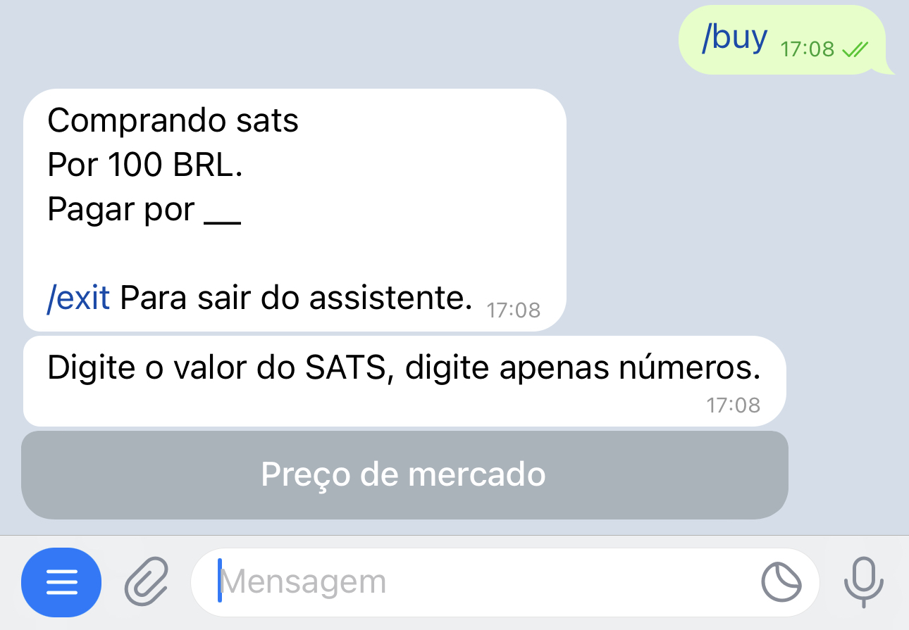
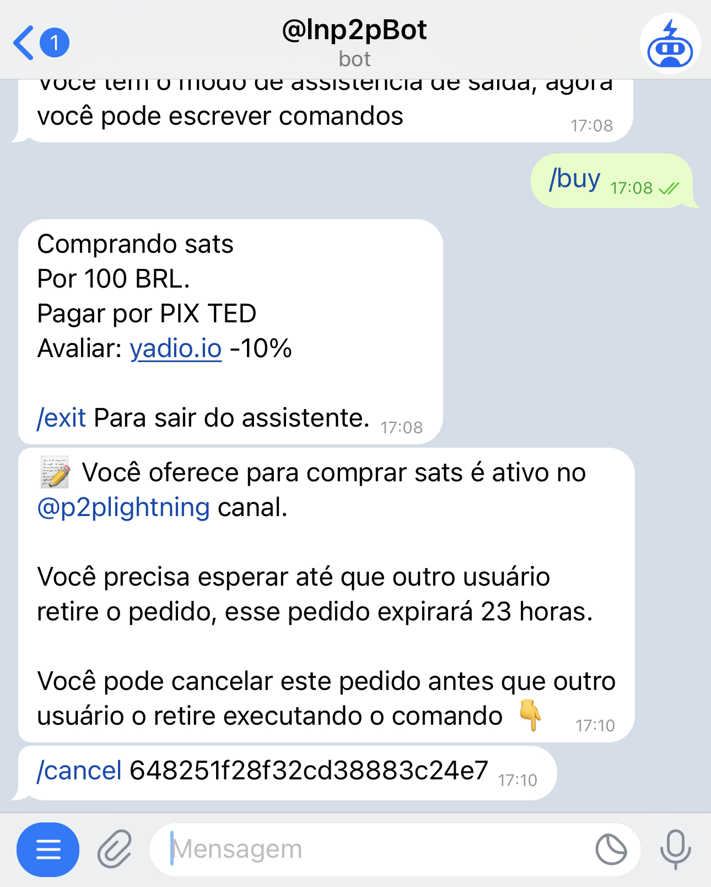
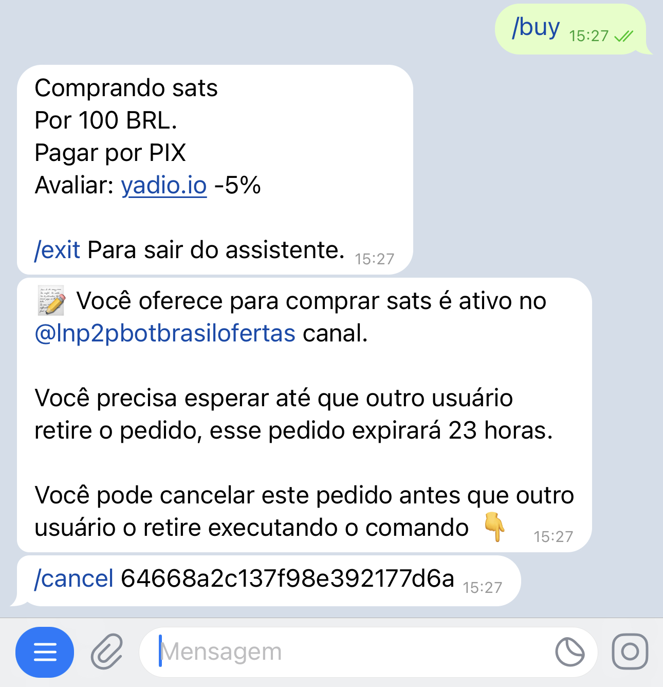

# Como eu crio uma oferta de compra?

O procedimento é exatamente o mesmo que para o pedido de venda. Apenas que, ao pressionar o botão "Menu", você deve selecionar o comando `/buy` em vez de `/sell`. Isso ativará o assistente que o guiará pelo processo de compra.

Depois de ativado, o assistente solicitará que você especifique a moeda fiat com a qual deseja transacionar:

A seguir, você deve introduzir o valor, em moeda fiat, que deseja comprar. Lembre-se de inserir apenas números nesta etapa, para que o assistente possa entender.

Você também pode introduzir um intervalo de quantidades a comprar, separando os números por um hífen (-).

O assistente perguntará o valor, em satoshis, que deseja receber. Aqui, você tem a possibilidade de usar o botão "Preço de mercado". Se o fizer, a taxa de [Yadio.io](https://yadio.io/) será aplicada.

O próximo passo que o assistente solicitará é a porcentagem de acréscimo ou desconto que você deseja em sua troca. Se você quiser aumentar a taxa de mercado (acréscimo), selecione um número positivo; se você quiser diminuí-la (desconto), selecione um número negativo. Caso não queira nenhum, use o botão "Sem acréscimo ou desconto".

A seguir, você deve especificar o método de pagamento. Neste campo, você pode ser criativo e adicionar emoticons ou o que considerar para tornar sua oferta atraente.

O bot publicará sua oferta no canal geral ou na comunidade que você configurou como padrão. Ela ficará visível por 23 horas, se ninguém a pegar antes desse tempo.

Você pode cancelar a oferta a qualquer momento, desde que ninguém a tenha aceitado, usando o comando `/cancel` seguido do identificador do pedido. Você também pode copiar o comando mais o identificador no chat com o bot.

O assistente lhe enviará uma mensagem confirmando o cancelamento e removerá sua oferta do canal de ofertas.

Se sua oferta for aceita, o assistente solicitará que você entregue uma fatura na Lightning Network com o valor em satoshis correspondente. Ao mesmo tempo, solicitará ao seu contraparte que pague a fatura.

Neste momento, o bot colocará ambas as partes em contato para discutir os detalhes da troca.

Assim que você fizer o pagamento em fiat, notifique o bot com o comando `/fiatsent`. O bot avisará ao seu contraparte para verificar e confirmar o recebimento do dinheiro e proceder à liberação dos satoshis. Lembre-se de que sua carteira deve estar online para recebê-los.

A troca foi concluída. Agora você pode avaliar sua contraparte.

Você pode sair do assistente a qualquer momento executando o comando `/exit`.

Para executar a mesma ordem de compra, sem usar o assistente, você deve escrever sua ordem com os detalhes: `/buy`<valor em sats> <valor em fiat> <código fiat> <método de pagamento> [prêmio/desconto] (sem os caracteres especiais).

Exemplo: `/buy 100000 50 usd "banco xyz"`

Eu compro cem mil sats por cinquenta dólares, pagando pelo banco xyz.

Alguns exemplos de ordens de compra seriam os seguintes:

- Ex. `/buy 0 50 ves "banco xyz"`: Compro cinquenta bolívares em sats - neste caso, o bot calculará a taxa de mercado - pago pelo banco xyz.
- Ex. `/buy 0 10-100 pen "pagamento móvel"`: Compro de 10 a 100 novos soles - neste caso, o vendedor escolherá qual valor vender dentro dessa faixa - pago por pagamento móvel.
- Ex. `/buy 0 100 eur -3 "pagamento móvel"`: Compro 100 euros com desconto de 3% - neste caso, o bot calculará a taxa de mercado descontando ou aumentando a porcentagem que você escolher - pago por pagamento móvel.

Se houver alguma variável incompatível, o bot indicará durante o processo de criação da ordem. Após concluí-la, ela será publicada automaticamente no canal de troca e será visível por um período de 23 horas.