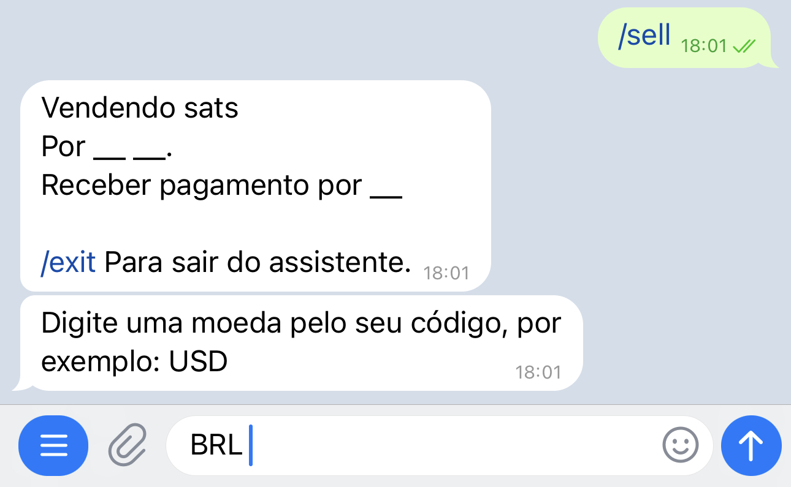
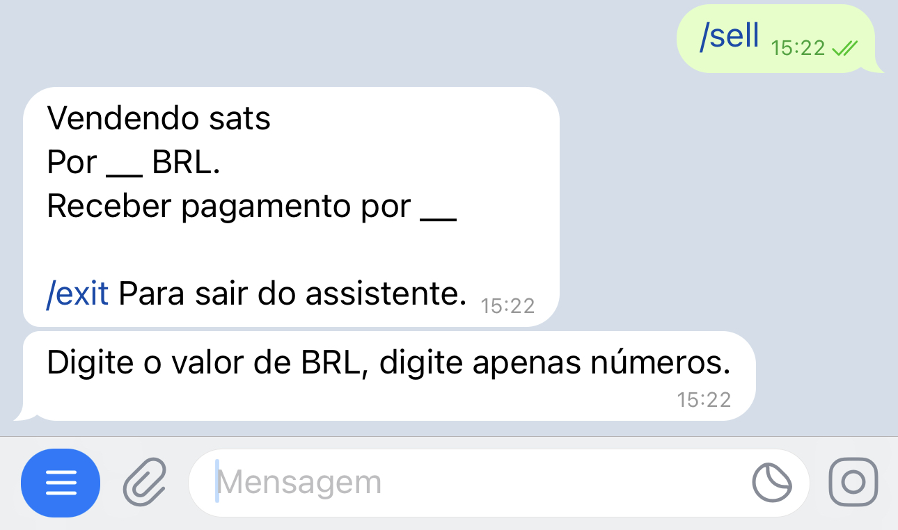
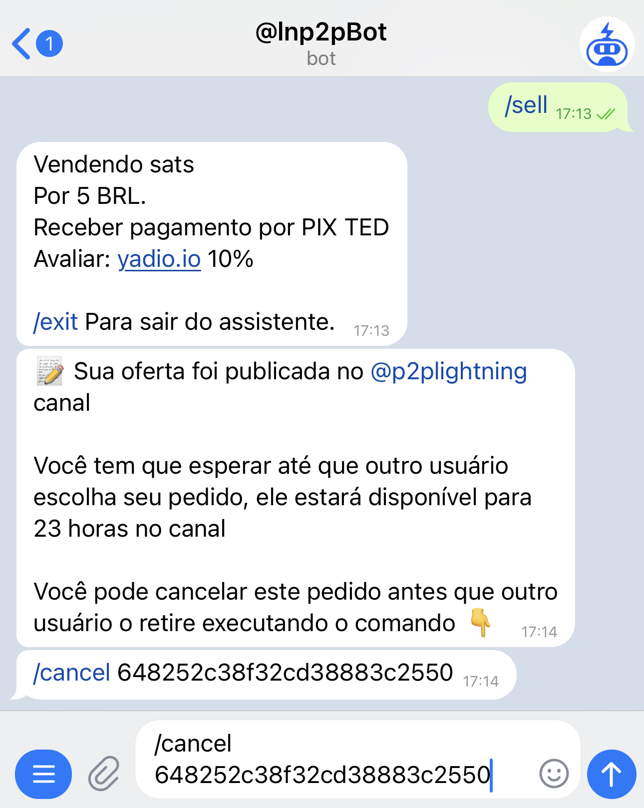

# Como eu crio uma ordem de venda?

Ao conversar com [@lnp2pBot](https://t.me/lnp2pbot), você encontrará um botão de "Menu". Clique nele para exibir a lista de comandos que você pode usar. Selecione o comando de venda: `/sell`, para ativar o assistente que irá guiá-lo pelo processo de venda.

Uma vez ativado, o assistente solicitará que você especifique a moeda fiduciária na qual deseja negociar:

Em seguida, você precisará inserir o valor, em moeda fiduciária, que deseja receber em troca de seus satoshis. Lembre-se de inserir apenas números nesta etapa, para que o assistente possa entendê-lo.

Você também pode inserir um intervalo de quantidades a serem compradas, separando os números por um traço (-).

O bot perguntará a quantidade, em satoshis, que você deseja entregar. Aqui você tem a opção de usar o botão "Preço de mercado". Se o fizer, a taxa de [Yadio.io](https://yadio.io/) será aplicada.

O próximo passo que o assistente solicita é a porcentagem de acréscimo ou desconto que você deseja em sua negociação. Se você deseja aumentar a taxa de mercado (acréscimo), selecione um número positivo; se você deseja diminuí-la (desconto), selecione um número negativo. Se você não quiser nenhum, use o botão "Sem acréscimo nem desconto".

Em seguida, você deve especificar o método de pagamento. Neste campo, você pode ser criativo e adicionar emojis ou o que considerar atraente em sua solicitação.

O bot procederá a publicar sua oferta no canal geral ou na comunidade que você configurou como padrão. Ela ficará visível por 23 horas, se ninguém a aceitar antes desse tempo.

A qualquer momento, você pode cancelar a oferta, desde que ninguém a tenha aceitado, usando o comando `/cancel` seguido do identificador da ordem. Você também pode copiar o comando mais o identificador no chat com o bot.

O assistente enviará uma mensagem confirmando o cancelamento e removerá sua oferta do canal de ofertas.

Se sua venda for aceita, o bot solicitará que sua contraparte forneça uma fatura da Lightning Network.

Ao mesmo tempo, ele pedirá que você pague a fatura com o valor em satoshis correspondente, mais uma comissão de 0,6%. Lembre-se de que a rede pode cobrar um valor adicional pelo roteamento do pagamento. Esse valor dependerá dos nós pelos quais sua transação passará e do estado da rede. O bot não tem nada a ver com esse valor.

Nesse momento, o bot entrará em contato com ambas as partes para que discutam os detalhes da troca.

Assim que o bot receber a notificação de que o valor em fiat foi pago, ele enviará um alerta para que você verifique sua conta. Se estiver tudo em ordem, você pode liberar os satoshis com o comando `/release`, seguido do identificador da transação (ou copiar e colar o texto no chat do bot), e a transação será executada.

A troca foi concluída. Agora você pode avaliar sua contraparte.

Você pode sair do assistente a qualquer momento executando o comando `/exit`.

Para executar a mesma ordem de venda sem usar o assistente, você deve escrever sua ordem com os detalhes: `/sell <valor em sats> <valor em fiat> <código fiat> <método de pagamento> [prêmio/desconto]` (sem os caracteres especiais).

Exemplo: `/sell 100000 50 usd "banco xyz"` Vendo cem mil sats por cinquenta dólares, pago pelo banco xyz.

Se houver alguma variável incompatível, o bot informará durante o processo de criação da ordem. Ao concluí-la, ela será publicada no canal de troca e ficará visível por um período de 23 horas.